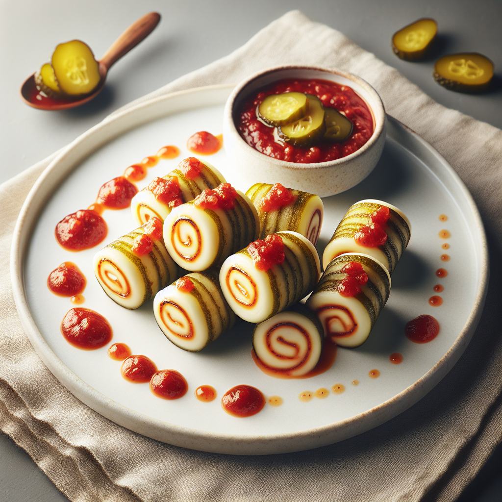
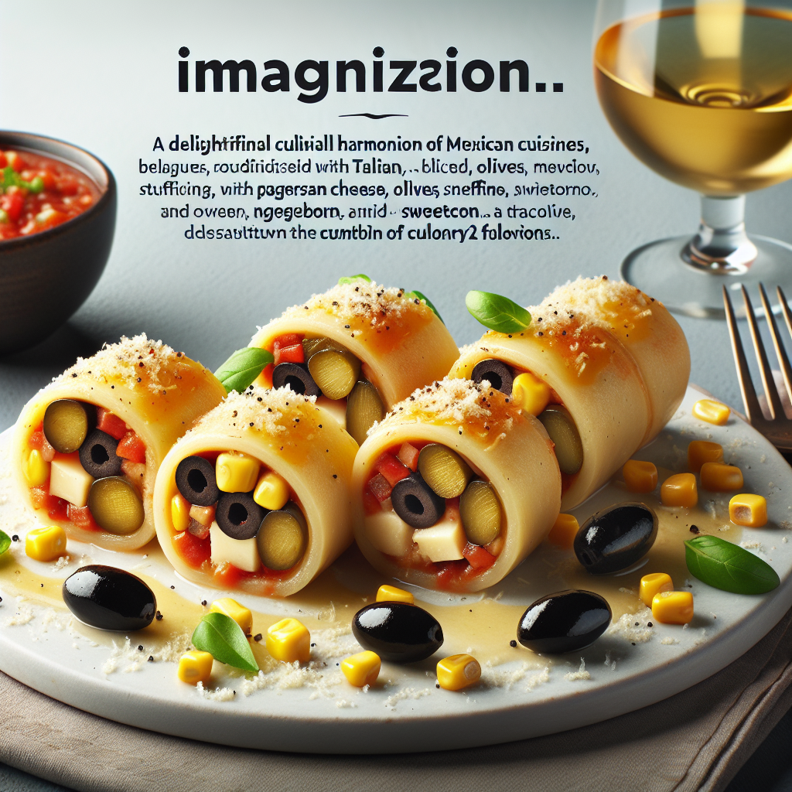
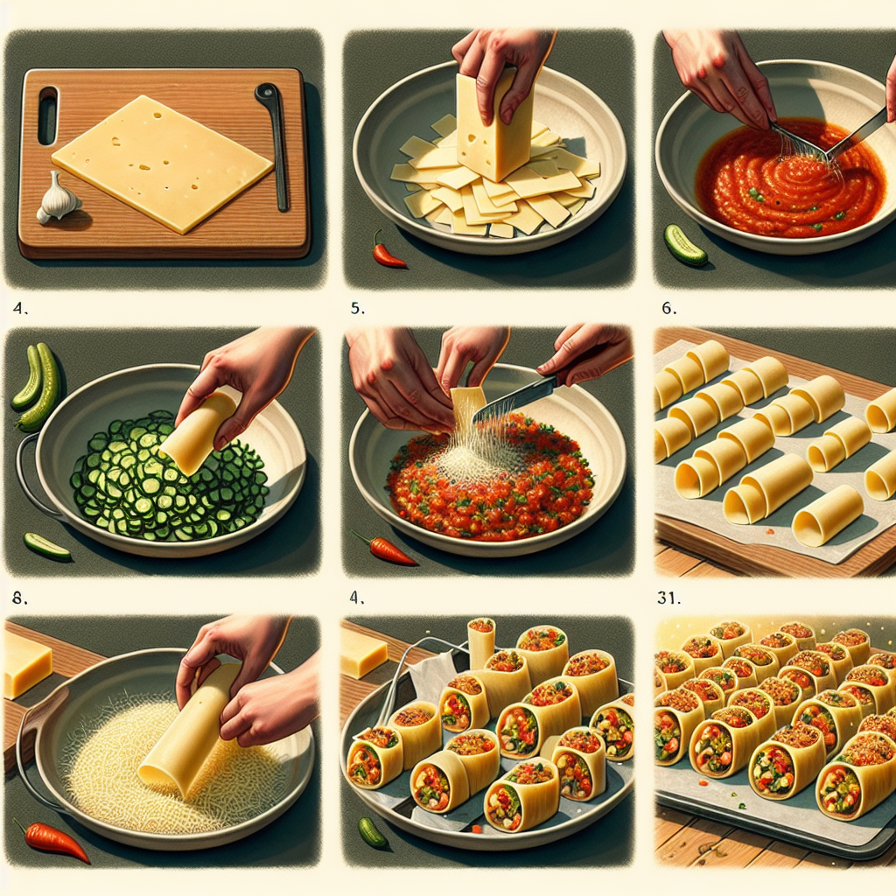
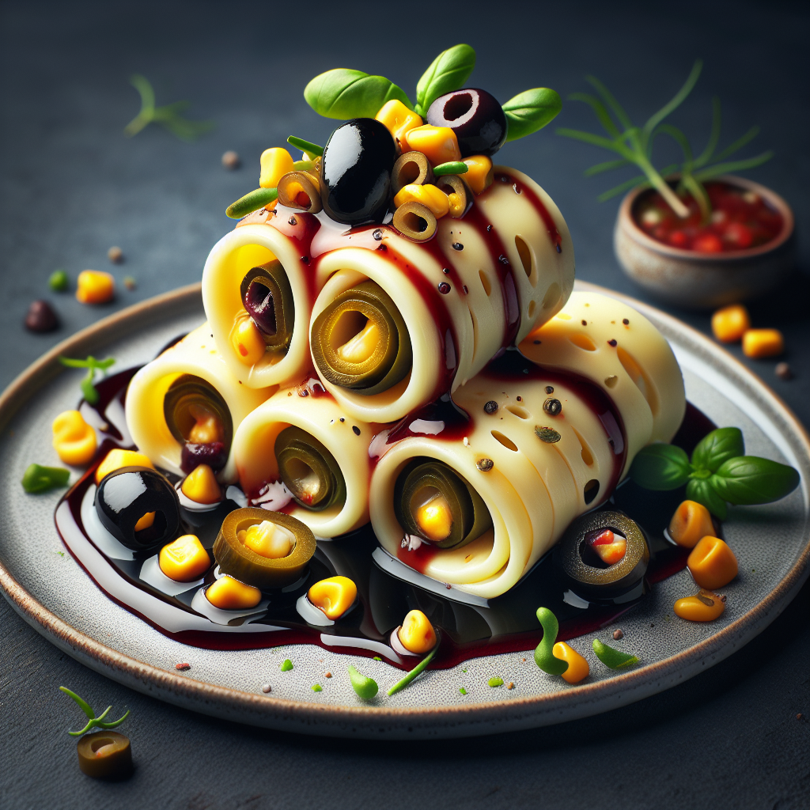

# The parts

## vision.py / vision-v2.php

Uploads the image and in return gets a list of possible items / groceries in the refridgerator.

## parse.py / parse.php

Takes the response from vision.py and reformats the ingredients list to a list starting with dashes.

## ask3.py / completion-multiprompt.php

The list from parse.py is added to the prompt which GPT-4 will use to come up with a reciepe. 
When GPT-4 answers a follow up question is given to get 4 possible DALL-E prompts.

## dalle.py / image-create.php

Instructs DALL-E to generate the different 4 images from ask3.py

## RESULTS

```GPT-4 says: RECIPE NAME:      
Salsa Parmigiano Gherkin Rolls

ORIGIN:
Italian-Mexican fusion        

PREPARATION TIME: 
30 Minutes

ESTIMATED CALORIES:
400-450 Calories

INGREDIENTS:

1. Old El Paso Salsa - 200 grams
2. Pickled Gherkins - 2 pieces
3. Mustard (brand starting with "Maille") - 1 tablespoon
4. Sparkling Wine - 1 glass
5. Chilled spreadable product (Lurpak or similar) - 1 tablespoon
6. Sweetcorn (drained) - 1 tablespoon
7. Parmesan Cheese - 50 grams
8. Black olives (drained and pitted) - 5 pieces
9. Herbs (of your choice) - as needed

(Optional: Condiment in white-to-cream colored containers can be used for extra flavor)

INSTRUCTIONS:

1. Preheat the oven to 200 degrees Celsius.

2. Thinly slice Parmesan cheese with a cheese slicer. You should have eight thin slices, around the same length as the gherkins.

3. Spread each slice of cheese with a thin layer of the chilled spreadable Lurpak product.

4. Thinly slice the gherkins and black olives. Mix them with the sweetcorn in a bowl and apply a dab of mustard and salsa to it. Mix thoroughly ensuring the condiments are evenly spread.

5. Next, place this mixture evenly onto the cheese slices and carefully roll them.

6. Once you have the rolls ready, place them on a baking tray lined with baking paper.

7. Bake these rolls in the preheated oven for 10 minutes.

8. In the meantime, heat a pan. Add the rest of the salsa, a tablespoon of mustard, and a pour of sparkling wine into the pan. Simmer for a few minutes until the wine has reduced.      

9. Pull out the rolls from the oven once they are golden brown and have melted slightly.

10. Pour the warm salsa wine reduction onto a plate, then carefully place the Parmigiano Gherkin Rolls on top. Drizzle the rolls with the remaining salsa and garnish with herbs of your 
choice.

Serve your Salsa Parmigiano Gherkin Rolls hot and enjoy this unique Italian-Mexican fusion dish.```





